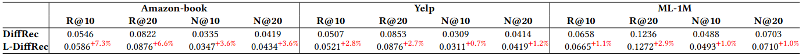

# *运行*
可根据DiffRec-main和ReChorus-master中的README的运行方法

### **1. 背景介绍**

在当今信息化时代，推荐系统已经渗透到各类互联网平台中，成为连接用户与内容的重要桥梁。例如，在电子商务平台（如亚马逊和淘宝），推荐系统帮助用户快速找到感兴趣的商品；在流媒体服务中（如Netflix和Spotify），系统为用户推送契合其喜好的视频或音乐；在社交媒体平台（如抖音和Instagram），推荐机制驱动了用户与内容之间的互动，提升了用户留存率。

随着数据规模的增长和用户需求的多样化，推荐系统逐渐从简单的规则方法演化为高度复杂的机器学习系统。然而，现代推荐技术仍然面临以下挑战：
1. **数据稀疏性**：大多数用户只与少量物品交互，交互矩阵极度稀疏，导致推荐模型难以有效习。
2. **噪声问题**：用户行为数据中往往存在噪声，例如误点击和虚假的交互记录。
3. **动态偏好**：用户兴趣会随时间变化，推荐模型需要适应这种变化。

#### **常见的推荐系统技术包括以下几种：**  

##### **1、基于内容的方法：**  
早期的推荐系统多采用基于内容的推荐方法，通过分析物品的特征为用户推荐相似物品。例如，在电影推荐场景中，用户喜欢某部电影后，系统会推荐具有相同导演或相似题材的电影。然而，这种方法有两个主要问题：依赖于高质量的物品特征描述，获取这些特征可能代价高昂；容易导致推荐的多样性不足，用户探索性体验较差。  

##### **2、协同过滤：**  
协同过滤方法通过挖掘用户行为之间的相似性实现推荐。分为两种主要类型：1、通过找到相似用户群体，推荐这些用户喜欢的物品。2、通过分析物品的相似性，将用户对某物品的喜好推及至相似物品。协同过滤的优势在于无需显式依赖物品特征，但它在以下情况下表现较差：数据稀疏性高时，无法有效建立相似性；面对新用户或新物品时，即“冷启动问题”，缺乏足够的历史数据支持。

##### **3、矩阵分解方法**  
矩阵分解技术通过将用户-物品交互矩阵分解为低维潜在因子表示（Latent Factors），有效解决了数据稀疏性问题。典型的矩阵分解算法包括SVD（奇异值分解）和ALS（交替最小二乘法）。  然而，矩阵分解通常假设用户的偏好是静态的，难以捕捉时间变化特性。

尽管这些方法显著提高了推荐性能，但在应对数据噪声和动态变化时，仍有较大改进空间。

生成模型为推荐任务带来了新的研究视角，它们通过建模用户与物品交互的生成过程，可以更加准确地预测用户的未来行为。  

##### **1、GAN（生成对抗网络）**  

GAN通过生成器和判别器的对抗博弈，实现高质量的交互预测。生成器负责生成用户潜在的交互数据，而判别器则判别生成数据与真实数据的差异。然而，GAN在推荐任务中表现有限，主要因为：
1. **训练不稳定性**：生成器与判别器之间的动态博弈使得模型训练复杂，难以达到平衡。
2. **数据稀疏问题**：在稀疏交互矩阵中，GAN可能生成大量常见模式，忽视长尾物品。

##### **2、VAE（变分自动编码器）**  
VAE是一种基于概率图模型的生成方法，能够将用户交互数据映射到潜在空间，并通过解码器预测未来交互行为。VAE的优点在于：
1. 能够自然建模数据中的噪声。
2. 适合高维稀疏数据的分布建模。

然而，VAE在表达能力上仍然存在局限，特别是在需要高精度建模复杂用户行为的场景。

#### **扩散模型的潜力**  

扩散模型（Diffusion Models）最初用于图像生成，通过逐步添加噪声（正向扩散）和逐步去噪（逆向生成），实现对数据分布的高效建模。其关键特性包括：
1. **逐步建模**：扩散模型通过迭代方式生成数据，能够捕获细粒度的分布特性。
2. **鲁棒性**：由于其核心机制是逐步去噪，扩散模型对噪声数据具有较强的适应能力。

扩散模型的这些特性表明其在推荐任务中具有很大潜力，特别是应对数据稀疏性和噪声问题。

#### **本文贡献**  

本文提出了一种基于扩散模型的推荐框架（Diffusion Recommender Model, DiffRec），其创新点包括：
1. 提出扩散推荐模型（DiffRec），通过逐步去噪生成用户交互分布。
2. 针对推荐任务的特点，设计了两个扩展模块：L-DiffRec（降维扩散）和T-DiffRec（时间建模）。
3. 在三个真实数据集上进行实验，验证了DiffRec在干净数据、含噪数据和时间序列数据中的优越性。

### **2. 扩散推荐模型（DiffRec）**

#### **2.1 建模过程**  
扩散模型由两个核心过程组成：正向扩散和逆向生成。  

##### **正向扩散过程**  
正向扩散通过逐步添加噪声，将原始数据分布扰乱为高斯分布：

$q(\mathbf{x}_t | \mathbf{x}_{t-1}) = \mathcal{N}(\mathbf{x}_t; \sqrt{1-\beta_t} \mathbf{x}_{t-1}, \beta_t \mathbf{I})$

其中，$\beta_t$为每一步的噪声强度参数。经过多次迭代，数据逐渐被转换为接近标准正态分布的形式。

##### **逆向生成过程**  
逆向生成从完全扰乱的数据开始，通过神经网络逐步去噪恢复原始数据：

$p_\theta(\mathbf{x}_{t-1} | \mathbf{x}_t) = \mathcal{N}(\mathbf{x}_{t-1}; \mu_\theta(\mathbf{x}_t, t), \Sigma_\theta(\mathbf{x}_t, t))$

其中，$\mu_\theta$和$\Sigma_\theta$由参数化神经网络生成。

##### **优化目标：ELBO**  
扩散模型的优化通过最大化证据下界（ELBO）实现：

$\mathcal{L}_{\text{ELBO}} = \mathbb{E}_q[\log p_\theta(\mathbf{x}_0 | \mathbf{x}_1)] - \sum_{t=2}^T \mathbb{E}_q[D_{\text{KL}}(q(\mathbf{x}_{t-1} | \mathbf{x}_t, \mathbf{x}_0) || p_\theta(\mathbf{x}_{t-1} | \mathbf{x}_t))]$

#### **2.2 DiffRec的创新点**  
扩散推荐模型的核心在于使用扩散模型预测用户未来的交互概率，其主要设计包括以下几个模块：
1. **正向扩散**：通过添加小规模的噪声逐步扰乱用户交互历史，同时避免完全丢失个性化信息。
2. **逆向生成**：通过参数化神经网络逐步去噪，恢复用户可能的交互分布。

#### **L-DiffRec和T-DiffRec扩展** 
面对推荐场景下的应用与挑战，扩散模型同样面临以下挑战：
1.	高维稀疏性：用户与物品交互矩阵通常是稀疏的，直接扩散可能导致数据丢失。
2.	资源开销：生成模型需要对所有物品的交互概率进行预测，计算成本高昂。
3.	动态偏好：用户偏好随时间变化，需要模型具备时间敏感性。

为解决推荐任务中的资源和动态问题，DiffRec提出了两种扩展：
1.	L-DiffRec（降维扩散）：通过物品聚类和潜在空间扩散，降低计算复杂度。
2.	T-DiffRec（时间建模）：采用时间权重策略，捕捉用户偏好的时间变化。

### **3. 实验与结果**  

实验在三个真实数据集上进行：

Amazon-book：包含丰富的书籍交互数据。 
Yelp：用户对餐馆的评价数据。
ML-1M：电影评分数据集。

数据集分为干净数据（去除低评分）、含噪数据（加入低评分或随机噪声）和时间序列数据三种设置。采用Recall@K和NDCG@K评估推荐效果。

#### **3.1 DiffRec在不同设置下的性能表现**  

#### **3.2 实验结论**  
1.	干净数据集上的表现
DiffRec在三个数据集上的推荐精度显著高于基线模型（如MultiVAE和LightGCN）。这表明扩散模型对用户复杂偏好的建模能力优于传统生成模型。
2.	含噪数据上的鲁棒性分析
在含自然噪声和随机噪声的数据集上，DiffRec表现出较强的抗噪能力。特别是当噪声比例增加时，DiffRec仍能保持较高的推荐精度。
3.	重要性采样的作用：通过在高损失步骤上增加权重，显著提高了模型的优化效果。
4.	噪声规模的影响：过大的噪声会削弱个性化信息，适当的噪声规模能够提升性能。
5.	L-DiffRec对资源消耗的优化效果：与DiffRec相比，L-DiffRec在性能接近的情况下显著降低了内存和参数开销。
6.	T-DiffRec对时间序列建模的提升：在时间序列数据集上，T-DiffRec优于现有的序列推荐模型（如ACVAE）。

